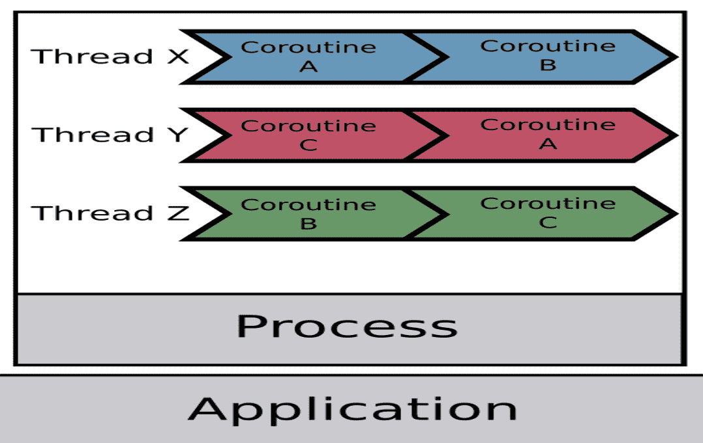

# Coroutine

## 簡介

所謂**協程( Coroutine)** 就是一個可以暫停將執行權讓給其他協程或 Awaitable object 的函數，等其執行完後再繼續執行，並可以多次的進行這樣的暫停與繼續。

&#x20;coroutine 與 thread 的概念相似，卻有許多截然不同的特性，不少場合使用 coroutine 既能優雅地解決問題，又能避免 multi-threading 的 race condition。

Coroutine 可以視為「可以中斷及繼續執行的函式呼叫」。在一般的程式語言中，呼叫某個函式時，該函式一定是從頭開始執行。然而 coroutine 允許函式執行到一半就中斷（yield），中斷時內部狀態會被保留下來，呼叫端可以隨時在之後恢復（resume）這個 coroutine。

### 協程定義&#xD;

協程是一種用戶態的輕量級線程，可以想成一個執行緒裡面可以有多個協程，**而協程的調度完全由用戶控制**，協程也會有自己的 registers、context、stack 等等，並且由協程的調度器來控制說目前由哪個協程執行，哪個協程要被 block 住。

而相對於執行緒及行程的調度，則是由 CPU 內核去進行調度，因此 OS 那邊其實會有所謂許多的調度算法，並且可以進行搶占式調度，可以主動搶奪執行的控制權。反之，協程是不行的，只能進行非搶佔式的調度。

可以理解成，如果 coroutine 被 block 住，則會在用戶態直接切換另外一個 coroutine 給此 thread 繼續執行，這樣其他 coroutine 就不會被 block 住，讓資源能夠有效的被利用，藉此實現 Concurrent 的概念。

