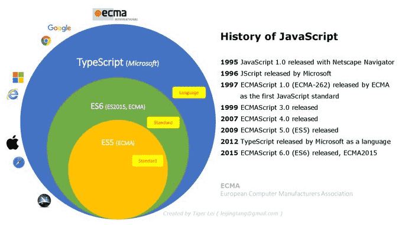

# Javascript與ECMAScript

## 簡介

ECMAScript(ECMA-262)是一種手稿語言的標準化規範；最初命名為Mocha，後來改名為LiveScript，最後重新命名為JavaScript。儘管JavaScript和JScript與ECMAScript相容，但包含超出ECMAScript的功能。

JavaScript 所採用的標準是 ECMAScript，自 2012 年起，所有現代的瀏覽器均已全面支援 ECMAScript 5.1。較老舊的瀏覽器最少也會支援 ECMAScript 3。ECMA International 於 2015 年 6 月 17 日發佈第六版的 ECMAScript，其正式名稱是 ECMAScript 2015，原先被稱作 ECMAScript 6 或 ES6。從那時起， ECMAScript 標準的發布週期是一年。

* ES5：是 ECMAScript 第五版的簡稱，是從 2009 年後正式被認定為標準規範，現在幾乎所有主流瀏覽器都支援 ES5。
* ES6/ES2015：像是解構賦值、箭頭函式、class 語法等等都是在 ES6 版本當中規範。因為 ES6 在 2015 年發佈所以又叫做 ES2015，目前看起來似乎是用 ES + 年份居多，如 ES2016/ES2017。
* ESNext: 為下一版釋出前的通稱。

## 參考資料

* [\[MDN\] Javascript](https://developer.mozilla.org/zh-TW/docs/Web/JavaScript)
* [ECMA-262](https://www.ecma-international.org/publications-and-standards/standards/ecma-262/)
* [\[W3School\] Javascript tutorial](https://www.w3schools.com/js/default.asp)
* [Browser ECMAScript相容列表](https://kangax.github.io/compat-table/es6/)
* [\[iT邦\]從ES到ESNext - 30天輕鬆掌握ECMAScript 系列](https://ithelp.ithome.com.tw/users/20110962/ironman/3303)
* [\[鐵人賽\] 深入現代前端開發 系列](javascript-yu-ecmascript.md#jian-jie)
