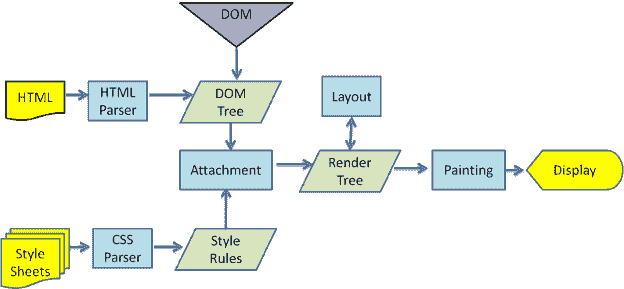

# 瀏覽器裡的 JavaScript

## 簡介

嚴格來說，JavaScript (或者說 ECMAScript 標準) 並沒有提供網頁的操作方法。

事實上，前端開發者在網頁的操作方法都是由 JavaScript 的執行平台，也就是「瀏覽器」提供的。 這些操作方法基本上會分別由這兩種物件所擁有：「BOM」與「DOM」。

廣泛來說，在瀏覽器上的 JavaScript 實際上包含了：

* JavaScript 核心 (以 ECMAScript 標準為基礎)&#x20;
* BOM (Browser Object Model，瀏覽器物件模型)&#x20;
* DOM (Document Object Model，檔案物件模型)&#x20;

以上這三個部分。

由於「BOM」與「DOM」是由瀏覽器執行環境所提供。 換句話說，在 node 環境下的 JavaScript 就不會有這兩個部分。

前端開發者就是透過 JavaScript 去呼叫 BOM 與 DOM 提供的 API，進一步透過它們去控制瀏覽器的行為與網頁的內容。

## script標籤放置位置的區別



當瀏覽器在 head之間遇到script標籤時，就會暫停解析網頁，並且「立即」執行script裡的內容，直到 script 執行完畢後再繼續解析網頁。

因此如果將操作html tag的script放置在head時，由於html尚未完全讀入，因此會無法正確操作html元素。

當我們把script標籤放在body結束之前，由於 DOM 已經解析完成，所以 document.querySelector 就可以順利取得指定 id 的節點，並且把修改的內容放在網頁裡囉。

因此script內容放在head適用於事件處理與網頁優化的情形。

## BOM 簡介

BOM (Browser Object Model，瀏覽器物件模型)，是瀏覽器所有功能的核心，與網頁的內容無關。

在早期沒有制定標準規範的時候，各家瀏覽器廠商幾乎各自在自家瀏覽器上實作功能，非常混亂。 直到最近幾年， W3C 把各家瀏覽器都有實作的部分，以及確定已經(或未來會) 加入的功能，統一集合起來納入了 HTML5 的標準中，這也就是我們現在看到的 BOM API 的實作。

BOM 也有人非正式地稱它為 「Level 0 DOM」。 因為它在 DOM level 1 標準前就已存在，而不是真的有檔案去規範這些，所以「Level 0 DOM」與「BOM」兩者實際上指的是同一個東西。

### BOM 的核心 window 物件

.png>)

* BOM 的核心是 window 物件。而 window 物件提供的屬性主要為 document、location、navigator、screen、history 以及 frames。

在瀏覽器裡的 window 物件扮演著兩種角色：

* ECMAScript 標準裡的「全域物件」 (Global Object)&#x20;
* JavaScript 用來與瀏覽器溝通的視窗

凡是在「全域作用範圍」內宣告的變數、物件、函式等，都會自動變成「全域物件」的屬性。 通常這樣的變數，我們會稱它們叫做「全域變數」，可以透過 window.xxx 的方式取得它們。

```javascript
var a = 10;
console.log( window.a );    // 10
```

除此之外，在「全域作用範圍」宣告的全域變數還有一個特性，就是無法使用 delete 關鍵字來移除：

```javascript
var a = 10;
console.log( window.a );    // 10

delete window.a;            // false
console.log( window.a );    // 10
```

但若是直接透過指定 window 物件的屬性則可以刪除

```javascript
window.a = 10;
console.log( window.a );    // 10

delete window.a;            // true
console.log( window.a );    // undefined
```

### alert() 警告對話方塊

alert 的完整語法其實是這樣：

```javascript
window.alert(message);
```

如同全域變數一樣，window 物件下的成員，window 是可以省略不打的。

類似的對話方塊還有用來提供「確定/取消」的 window.confirm() ，以及開放式問答的 window.prompt()  對話方塊。

## DOM簡介

DOM (Document Object Model，檔案物件模型)，是一個將 HTML 檔案以樹狀的結構來表示的模型，而組合起來的樹狀圖，我們稱之為「DOM Tree」。


在最根部的地方，就是 document，就是 BOM 圖中 window 下面的那個。

DOM API 就是定義了讓 JavaScript 可以存取、改變 HTML 架構、樣式和內容的方法，甚至是對節點繫結的事件。

JavaScript 就是透過 DOM 提供的 API 來對 HTML 做存取與操作。

### 「DOM」 與「BOM」的區別

DOM 的 document 其實也是 window 物件的子物件之一。

而「DOM」 與「BOM」最大的區別在於：

* BOM: JavaScript 與「瀏覽器」溝通的視窗，不涉及網頁內容。&#x20;
* DOM: JavaScript 用來控制「網頁」的節點與內容的標準。&#x20;
* 「BOM」完全依賴於瀏覽器廠商實作本身無標準規範，而「DOM」有著 W3C 所制定的標準來規範。

想要透過 DOM API 取得節點，透過 JavaScript 可以這樣寫：

```javascript
// 根據傳入的值，找到 DOM 中 id 為 'xxx' 的元素。
document.getElementById('xxx');

// 針對給定的 tag 名稱，回傳所有符合條件的 NodeList 物件 [註1]
document.getElementsByTagName('xxx');

// 針對給定的 class 名稱，回傳所有符合條件的 NodeList 物件。
document.getElementsByClassName('xxx');

// 針對給定的(CSS) Selector 條件，回傳第一個 或 所有符合條件的 NodeList。
//NodeList 雖然有著與陣列相似的特性，但不是陣列，
//所以也不會有陣列相關的 method 可以使用 (如 map、filter 等)。
document.querySelector('xxx');
document.querySelectorAll('xxx');
```

而透過 DOM API 選取出來的節點，我們可以透過操作 textContent 屬性來變更它的文字。

```javascript
<h1 id="greet"></h1>

<script>
//透過 document.querySelector() 方法來取得節點，然後修改 textContent 屬性
  document.querySelector('#greet').textContent = 'Hello World!'
</script>
```

### DOM 節點的型別

常見的有下面幾種

| 節點名稱                        | 對應數值 | 說明                                               |
| --------------------------- | ---- | ------------------------------------------------ |
| Node.ELEMENT\_NODE          | 1    | HTML元素的Element節點                                 |
| Node.TEXT\_NODE             | 3    | 實際文位元組點，包括了換行與空格                                 |
| Node.COMMENT\_NODE          | 8    | 註解節點                                             |
| Node.DOCUMENT\_NODE         | 9    | 根節點 (Document)                                   |
| Node.DOCUMENT\_TYPENODE     | 10   | 檔案型別的 DocumentType 節點，例如 HTML5 的\<!DOCTYPE html> |
| Node.DOCUMENT\_FRAGMENTNODE | 11   | DocumentFragment 節點                              |

可以透過節點型別「常數」或是「對應數值」來判斷節點型別：

```javascript
document.nodeType === Node.DOCUMENT_NODE;   // true
document.nodeType === 9;   // true
```

其餘類型可參考[\[MDN\] Node.nodeType](https://developer.mozilla.org/en-US/docs/Web/API/Node/nodeType)。

## DOM 節點間的查詢遍歷 (Traversing)

DOM 節點為樹狀結構，有分層的概念，因此節點與節點之間的關係，我們大致上可以分成兩種：

* <mark style="color:red;">父子關係</mark>： 除了 document 之外，每一個節點都會有個上層的節點，我們通常稱之為「父節點」 (Parent node)，而相對地，從屬於自己下層的節點，就會稱為「子節點」(Child node)。
* <mark style="color:red;">兄弟關係</mark>：有同一個「父節點」的節點，那麼他們彼此之間就是「兄弟節點」(Siblings node)。

.png>)
