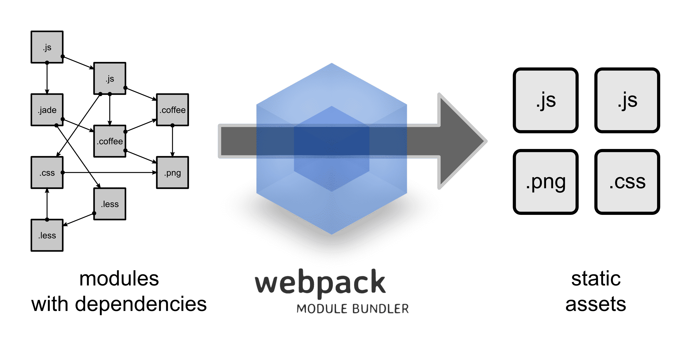

# webpack

## 為什麼需要webpack?

* 將你的 js 檔案 Bundle 變成單一的檔案：讓你可以撰寫模組化的 JavaScript，但是你不需要 include 每個 JavaScript 的檔案。
* 在前端程式碼中使用 npm packages(如使用typescript) 撰寫 JavaScript ES6 或 ES7（需要透過 babel 來幫助）
* 優化程式碼：減少你的檔案大小，好處包括像是更快的將頁面載入。
* 將 LESS 或 SCSS 轉換成 CSS：使用更好的方式來撰寫 CSS。
* 使用 HMR（Hot Module Replacement）：增加開發速度。每當你儲存程式碼的時候，它可以注入到網頁，而不需將網頁重新整理。
* 包含任何型別的檔案到你的 JavaScript：減少對其他 build 工具的需要，讓你可以透過程式的方式修改或使用這些檔案。

參考資料

* [Webpack Tutorial 繁體中文 Gitbook](https://neighborhood999.github.io/webpack-tutorial-gitbook/)

