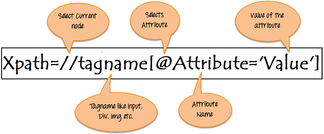

# xpath

## 簡介

XPath，全稱 XML Path Language，即 XML 路徑語言，它是一門在XML文檔中查詢資訊的語言。XPath 最初設計是用來搜尋XML文檔的，但是它同樣適用於 HTML 文檔的搜尋。

XPath是使用XML路徑表達式在網頁上查詢任何元素的語法或語言。**XPath用於使用HTML DOM結構查詢網頁上任何元素的位置**。<mark style="color:red;">lxml目前只有支援至XPath 1.0版本</mark>。

在爬取網頁中，如果一般定位符（如id，class，name等）找不到元素，可使用XPath在網頁上查詢元素。

## XPath的語法



XPath包含位於網頁上的元素的路徑。創建XPath的標准語法是：

```markup
Xpath=//tagname[@attribute='value']
```

* `//`：選擇當前節點。
* `Tagname`：特定節點的標記名。
* `@`：選擇屬性。
* `Attribute`：節點的屬性名稱。
* `Value`：屬性的值。

## 路徑的類型

XPath有兩種類型：

1. 絕對XPath
2. 相對XPath

### 絕對XPath

這是查詢元素的直接方法，但是絕對XPath的缺點是，如果在元素的路徑中進行了任何更改，則XPath將會失敗。

XPath的關鍵特徵是它以單個正斜線（/）開頭，這意味著您可以從根節點中選擇元素。

```markup
html/body/div[1]/section/div[1]/div/div/div/div[1]/div/div/div/div/div[3]/div[1]/div/h4[1]/b
```

### 相對xpath

對於相對Xpath，路徑從HTML DOM結構的中間開始。它以雙斜線（//）開頭，這意味著它可以在網頁上的任何位置搜尋元素。

您可以從HTML DOM結構的中間開始，而無需編寫長xpath。

```markup
//*[@class='featured-box']//*[text()='Testing']
```


## XPath的常用匹配規則

* `/` 代表選取直接子節點
* `//` 代表選擇所有子孫節點
* `.` 代表選取當前節點
* `..` 代表選取當前節點的父節點
* `@` 則是加了屬性的限定，選取匹配屬性的特定節點。

```markup
	//title[@lang=’eng’]
```

選擇所有名稱為 title，同時屬性 lang 的值為 eng 的節點。

```markup
//a[@href="https://ask.hellobi.com/link4.html"]/../@class
//a[@href="https://ask.hellobi.com/link4.html"]/parent::*/@class
```

首先選中 href 是 link4.html 的 a 節點，然後再獲取其父節點，然後再獲取其 class 屬性。也可以通過 parent:: 來獲取父節點。

```markup
//li[@class="item-0"]
//li[@class="item-0"]/text()
//li[@class="item-0"]//text()
```

* 選取 class 為 item-1 的 li 節點，可能有多個節點滿足條件。
* text() 方法可以獲取節點中的文字，如果\<li>\</li>中還有其它tag時，要再進入tag才能正確選到文字。也可以用//取得子孫節點的文字。

```markup
//li/a/@href
```

* 獲取所有 li 節點下所有 a 節點的 href 屬性。
* 此處和屬性匹配的方法不同，屬性匹配是中括號加屬性名和值來限定某個屬性，如 \[@href="https://ask.hellobi.com/link1.html"]，而此處的 @href 指的是獲取節點的某個屬性，二者需要做好區分。

```markup
<li class="li li-first">
    <a href="https://ask.hellobi.com/link.html">
    first item
    </a>
</li>

//li[contains(@class, "li")]/a/text()
//li[contains(@class, "li") and @name="item"]/a/text()
```

* 屬性有多個值就需要用 contains() 函式了。，第一個引數傳入屬性名稱，第二個引數傳入屬性值，這樣只要此屬性包含所傳入的屬性值就可以完成匹配了。
* 我們可能需要根據多個屬性才能確定一個節點，這是就需要同時匹配多個屬性才可以，那麼這裡可以使用運算子 and 來連接。

## //node\[1]與(node)\[1]的區別

* //node\[1]: 選擇相對於node的所有第一個節點。
* //(node)\[1]: 選擇文件中所有節點，且只取第一個元素。

```python
>>> from scrapy import Selector
>>> sel = Selector(text="""
....:     <ul class="list">
....:         <li>1</li>
....:         <li>2</li>
....:         <li>3</li>
....:     </ul>
....:     <ul class="list">
....:         <li>4</li>
....:         <li>5</li>
....:         <li>6</li>
....:     </ul>""")
>>> xp = lambda x: sel.xpath(x).getall()

# <li>有兩組，選出每一組的第一個元素
xp("//li[1]")
['<li>1</li>', '<li>4</li>']

# 全部的<li>視為一組，取第一個元素
xp("(//li)[1]")
['<li>1</li>']
```

## FAQ

### 使用/path/text()抓取資料時，如果/path中某些欄位之值為空時，text()會自動忽略空欄位

```bash
# 倒數第二個欄位的text為空值
In [36]: response.xpath('//table/tbody/tr[2]/td')
Out[36]: 
[<Selector xpath='//table/tbody/tr[2]/td' data='<td>0051</td>'>,
 <Selector xpath='//table/tbody/tr[2]/td' data='<td>元大中型100</td>'>,
 <Selector xpath='//table/tbody/tr[2]/td' data='<td>TW0000051002</td>'>,
 <Selector xpath='//table/tbody/tr[2]/td' data='<td>10,500,000</td>'>,
 <Selector xpath='//table/tbody/tr[2]/td' data='<td>10,391,929</td>'>,
 <Selector xpath='//table/tbody/tr[2]/td' data='<td>108,071</td>'>,
 <Selector xpath='//table/tbody/tr[2]/td' data='<td>98.97</td>'>,
 <Selector xpath='//table/tbody/tr[2]/td' data='<td>1.02</td>'>,
 <Selector xpath='//table/tbody/tr[2]/td' data='<td>100.00</td>'>,
 <Selector xpath='//table/tbody/tr[2]/td' data='<td>100.00</td>'>,
 <Selector xpath='//table/tbody/tr[2]/td' data='<td></td>'>,
 <Selector xpath='//table/tbody/tr[2]/td' data='<td>110/06/30</td>'>]
```

```bash
# 使用text()抓資料時，會自動省略空欄位之值
In [37]: response.xpath('//table/tbody/tr[2]/td/text()')
Out[37]: 
[<Selector xpath='//table/tbody/tr[2]/td/text()' data='0051'>,
 <Selector xpath='//table/tbody/tr[2]/td/text()' data='元大中型100'>,
 <Selector xpath='//table/tbody/tr[2]/td/text()' data='TW0000051002'>,
 <Selector xpath='//table/tbody/tr[2]/td/text()' data='10,500,000'>,
 <Selector xpath='//table/tbody/tr[2]/td/text()' data='10,391,929'>,
 <Selector xpath='//table/tbody/tr[2]/td/text()' data='108,071'>,
 <Selector xpath='//table/tbody/tr[2]/td/text()' data='98.97'>,
 <Selector xpath='//table/tbody/tr[2]/td/text()' data='1.02'>,
 <Selector xpath='//table/tbody/tr[2]/td/text()' data='100.00'>,
 <Selector xpath='//table/tbody/tr[2]/td/text()' data='100.00'>,
 <Selector xpath='//table/tbody/tr[2]/td/text()' data='110/06/30'>]
```

解法1：先抓列的xpath後，再將列中每一欄取text()，空白欄會變成None

```python
for li in response.xpath('//table/tbody/tr[2]/td'):
    print(li.xpath('text()').get())
    
0051
元大中型100
TW0000051002
10,500,000
10,391,929
108,071
98.97
1.02
100.00
100.00
None
110/06/30
```

## 參考資料

* [W3C xpath](https://www.w3.org/TR/xpath/)
* [XPath tutorial](https://www.zvon.org/comp/r/tut-XPath\_1.html)
* [XPath tips from the web scraping trenches](https://www.zyte.com/blog/xpath-tips-from-the-web-scraping-trenches/)
* [\[lxml\] XPath and XSLT with lxml](https://lxml.de/xpathxslt.html)
* [\[parsel\] Variables in XPath expressions](https://parsel.readthedocs.io/en/latest/usage.html#variables-in-xpath-expressions)
* [\[知乎\] Web自動化測試：xpath元素定位深入講解](https://zhuanlan.zhihu.com/p/145066705)
* [\[知乎\] selenium自動化測試：5.xpath八種定位方式](https://zhuanlan.zhihu.com/p/137524713)
* [\[知乎\] 學爬蟲利器XPath,看這一篇就夠了](https://zhuanlan.zhihu.com/p/29436838)
* [\[知乎\] 爬蟲入門到精通-網頁的解析（xpath）](https://zhuanlan.zhihu.com/p/25572729)
* [\[知乎\] Selenium WebDriver中的XPath：完整教程, Xpath cheatsheet, XPath教程, XPath用法詳解](https://justcode.ikeepstudying.com/2020/01/selenium-webdriver%E4%B8%AD%E7%9A%84xpath%EF%BC%9A%E5%AE%8C%E6%95%B4%E6%95%99%E7%A8%8B-xpath-cheatsheet-xpath%E6%95%99%E7%A8%8B-xpath%E7%94%A8%E6%B3%95%E8%AF%A6%E8%A7%A3/)
