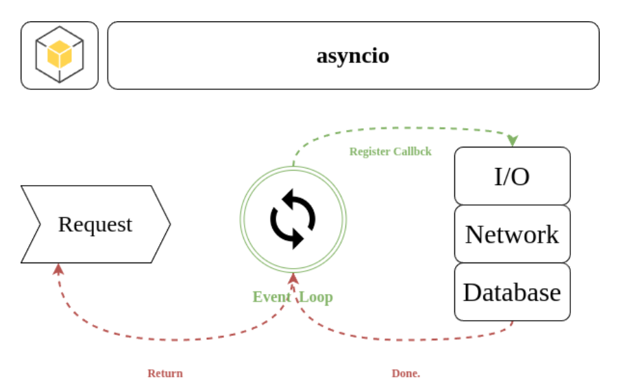

# asyncio

以python3.9之後的版本為主。

除了本身程式的運算之外， 在網路的傳輸(外部API)、硬碟的存取(I/O)的服務都不應該阻塞我們的程式， 因此我們可以透過 asyncio 來做一個任務委外的動作， 而程式本身的運算也能夠持續執行， 這就是非同步的主要使用情境。

同步與非同步程式的差別在於執行過程不會等待 IO 回應，而是繼續執行下面的程式碼，讓 IO 與後續流程作為事件 (event) 形式，並透過輪詢 (polling) 與回撥 (callback) 觸發執行後續程式碼。

### 並行 (Concurrent) 與平行 (Parallel)

並行 (Concurrent) 含意是一種「得以在同時間有兩個以上的計算在處理」的程式語言或是各種演算法；而平行 (Parallel) 是一種實現並行的一種模式。

一個衝突的案例是：當你只有一個處理器時，你依然可以擁有並行運算，但你無法透過平行實現。

<figure><figcaption><p>同步與非同步程式(<a href="https://codimd.mcl.math.ncu.edu.tw/s/yTqt6QuaZ">來源</a>)</p></figcaption></figure>


asyncio 能夠讓開發者針對類似上述提及的 I/O 等待時間造成程式效能低落的問題，將 CPU 從等待中解放，徹底利用 CPU 的運算資源。其原理為在程式中需要進行等待的地方，讓 CPU 切換執行其他工作，並稍後再切換回剛剛等待的地方確認是否等待已有結果，如果沒有結果就再進行切換執行其他工作(自行手動管理非同步函數的context switch)，看起來也很像同時間平行執行很多工作一樣，但資源的使用上相對於使用 multiprocessing 或 threading 模組來得少。

<figure><figcaption><p>非同步IO模組</p></figcaption></figure>


```python
# -*- coding: UTF-8 -*-
import asyncio
from time import time

import aiohttp
import requests


def do_requests():
    resp = requests.get('https://www.yahoo.com.tw/')
    print(f'https://www.yahoo.com.tw/ => {resp.status_code}')


def block_waiting_requests():
    t_start = time()
    for _ in range(0, 10):
        do_requests()
    print(f'blocking requests taken: {time() - t_start:.2f} secs')
    # 大約需要7.75秒執行時間


def do_async_requests(session):
    return session.get('https://www.yahoo.com.tw/')


async def waiting_requests():
    t_start = time()
    async with aiohttp.ClientSession() as session:
        tasks = []
        for _ in range(0, 10):
            tasks.append(do_async_requests(session))

        results = await asyncio.gather(*tasks)
        for r in results:
            print('https://www.yahoo.com.tw/', r.status)
    print(f'async requests taken: {time() - t_start:.2f} secs')
    # 大約需要1秒執行時間


if __name__ == '__main__':
    block_waiting_requests()
    asyncio.run(waiting_requests())

```


## Coroutines （協程）

簡而言之， coroutine 具有開始(enter)/暫停(exit)以及任意恢復(resume)執行的能力，譬如前述範例中發出 HTTP GET 要求之後，就暫停執行該函式，轉而執行其他工作，等到該 HTTP GET 要求收到伺服器回應之後，再轉回來恢復執行剩下的工作。

coroutine 與一般用 def 定義的函式/方法不同，是以`async def` 進行定義，也可以認為是透過 async def 明確告知 Python 該函式/方法具有非同步執行的能力。

另外`await`語法則是被用來告知 Python 可以在此處暫停執行 coroutine 轉而執行其他工作，而且該語法只能在 coroutine 函式內使用，因此 async def 與 await 通常會一起出現。

另 1 個關於 await 語法的重點是 await 之後只能接 awaitables 物件，例如 coroutine 或者是之後會介紹到的 Task, Future 以及有實作 **await**() 方法 的物件，所以不是所有的物件或操作都能夠用 await 進行暫停。

目前 Python 有 2 種實作 coroutines:

1. native coroutines&#x20;
2. generator-based coroutines&#x20;

第 1 種 native coroutines 是使用 async def 定義的函式。

第 2 種 generator-based coroutines 是用 @asyncio.coroutin 裝飾子寫成的函式，不過該種 coroutine 將於 Python 3.10 之後停止支援，因此不建議學習或者繼續使用。


