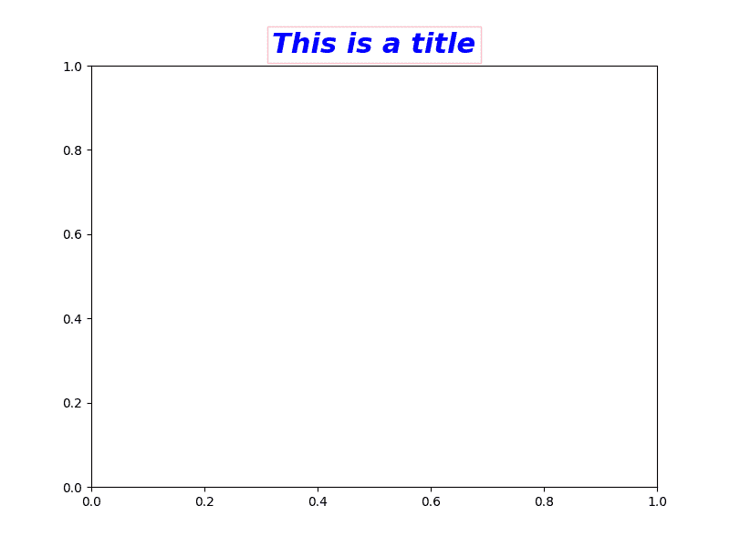

# matplotlib

## 簡介

matplotlib是一個強大的繪圖函式庫，但我在使用時，經常會忘記個別組件在圖表上的名稱與使用的方法，因此本文的重點在於以重點筆記的方式說明各組件的名稱與互動的方法。

matplotlib 的 API （Application Programming Interface）共分成兩種型態，一種是我們常見到的 plt.plot 或是 df.plot 的格式，另一種則是 ax.plot 的格式。

* `plt.plot`：繪圖的懶人包（包括 `df.plot` ），會幫你直接在最近使用的圖表上繪圖，沒有的話就會自動新建一個。 `plt.plot` 其實是一個黑盒子，他幫你把基礎的參數設定好，他就會在最近一張子圖生成圖表（沒有則會創建一張）；但這不代表背後就沒有 `figure` 和 `axes` 的運作。
* `ax.plot`：手動建立的 API，提供多項客製化的參數與圖表控制。

```python
# 直接將繪圖的所有組件全部用plt處理，不必管figure與axes的細節
import matplotlib.pyplot as plt
import numpy as np

x = np.linspace(0, 2, 100)

plt.plot(x, x, label='linear')
plt.plot(x, x**2, label='quadratic')
plt.plot(x, x**3, label='cubic')

plt.xlabel('x label')
plt.ylabel('y label')
plt.title("Simple Plot")
plt.legend()
plt.show()
```


```python
import matplotlib.pyplot as plt
import numpy as np
# 將 figure 例項化到 fig 的變數上，並設定寬與高（此處為預設值）
fig = plt.figure(figsize=(6, 4))

# 將 axe 新增到例項化後 2×2 的 figure 上，並指定第 1,2,3 個
ax_1 = fig.add_subplot(2, 2, 1)
ax_2 = fig.add_subplot(2, 2, 2)
ax_3 = fig.add_subplot(2, 2, 3)
plt.show()

# 以下程式碼有相同的結果
fig = plt.figure(num=4, figsize=(6, 4))
plt.subplot(221)
plt.subplot(222)
plt.subplot(223)
plt.show()
```


* 第一種方式plt，是先生成了一個畫布，然後在這個畫布上隱式的生成一個畫圖區域來進行畫圖。
* 第二種方式axes，先生成一個畫布，然後，我們在此畫布上，選定一個子區域畫了一個子圖。


## 組件

* Figure：可以把他當作畫布，一張畫布上可以有很多(至少一個)的 Axes。 也會包含了客制化的legend, titles等組件。
* Axes：就是我們俗稱的「子圖」，每個 Axes 一次只能在一張畫布上。這是實際繪圖的部份，Axes包含至少兩個Axis物件，其負責資料限制(`set_xlim()`, `set_ylim()等`)，每個Axes都有一個標題物件(title)，可透過`set_title()`設定。一個x軸標籤(透過`set_xlabel()`設定)，一個y軸標籤(透過`set_ylabel()`設定)。
* Axis：類似數字線的物件，負責圖形限制與生成軸的刻度(tick)的刻度線標記(tick labels) 。刻度的位置由Locator物件所決定，而刻度線標記由Formatter物件標記。


## 標題(title)

[一個plt.title設置標題，我有十種玩法！](https://mp.weixin.qq.com/s/tvXOHjIm5k41ls4IZJtBsQ)

如果是使用`plt`那麼就用`plt.title()`，如果使用`ax`可以使用`ax.set_title()`。

```python
matplotlib.pyplot.title(label, fontdict=None, loc='center', 
                         pad=None, **kwargs)

# 最簡單的標題                         
plt.title("This is a title")

# 通過fontsize參數調整字體大小，數字越大字體越大
plt.title("This is a title",fontsize = 20)

# 顏色可以使用color參數調整，可以是顏色名也可以是html顏色代碼
plt.title("This is a title",fontsize = 20,color = 'blue')

#可以通過fontstyle修改字體樣式，italic是斜體，oblique是傾斜 
plt.title("This is a title",fontsize = 20,
             color = 'blue',fontstyle='italic')
             
# 標題粗細可以通過修改fontweight完成，有以下選項
# 'light', 'normal', 'medium', 'semibold','bold', 'heavy', 'black'
plt.title("This is a title",fontsize = 20,color = 'blue',
fontstyle='italic',fontweight = "heavy")

# Matplotlib默認的字體是DejaVu Sans，
#如果你想修改字體可以使用family參數來實現，
#比如將字體修改為"cursive"，注意你使用的字體必須是Matplotlib能夠讀取到
plt.title("This is a title",fontsize = 22,color = 'blue',
            fontstyle='italic',fontweight = "heavy",family = "cursive")

# 標題位置可以通過loc參數調整，比如loc居左
plt.title("This is a title",fontsize = 22,color = 'blue',
           fontstyle='italic',fontweight = "heavy",
           family = "cursive", loc ='left')

# 可以通過rotation參數讓標題旋轉，比如旋轉345度
plt.title("This is a title",fontsize = 22,color = 'blue',
          fontstyle='italic',fontweight = "heavy",family = "cursive",
          loc ='left',rotation=345)

# 可以通過backgroundcolor給標題新增背景顏色，比如新增背景色是粉色
plt.title("This is a title", fontsize=22, color='blue', 
           fontstyle='italic', fontweight="heavy", family="cursive",
           loc='left', rotation=345, backgroundcolor='pink')

# 使用bbox參數給標題增加外框，需要為字典形式，其中
#  boxstyle控制方框外形，
#  fc控制背景顏色
#  ec控制邊框線條顏色
#  edgewidth控制邊框線條大小
plt.title("This is a title",fontsize = 22,color = 'blue',
           fontstyle='italic',fontweight = "heavy",family = "cursive",
           bbox=dict(ec='pink',fc ='w'))

# 我們可以發現，新增邊框後，標題跑到坐標系裡面去了，
# 所以可以使用verticalalignment調整水平對齊，
# 可以使用'center' , 'top' , 'bottom'和 'baseline'四種對齊方式，
# 豎直對齊可以使用horizontalalignment
plt.title("This is a title",fontsize = 22,color = 'blue',
           fontstyle='italic',fontweight = "heavy",family = "cursive",
           bbox=dict(ec='pink',fc ='w'),verticalalignment = 'bottom')
```



## 參考資料

* [official site](https://matplotlib.org/)
* [online matplotlib compiler](https://www.tutorialspoint.com/execute\_matplotlib\_online.php)
