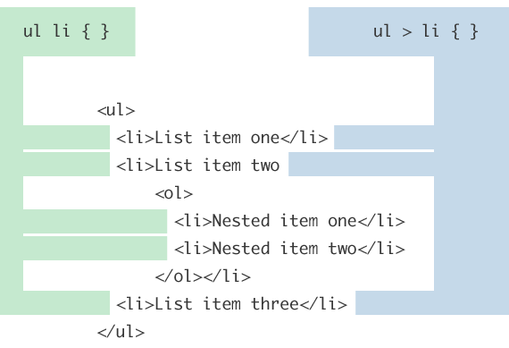

# css

## 簡介

css的功能，是指定特定標籤的樣式，可依標籤的名稱、標籤的id、或是標籤的class來指定。因此css本身就具有selction的功能。

如果頁面中指定的元素沒有id或class時，使用css指定樣式也是很好的方法。由於爬蟲的重點在於selector，因此不需深入property的部份，有概念即可；

## CSS套用

若一個 HTML 檔案中包含有多個樣式表，那串接(cascade)這個概念就非常重要了。串接是指當不同樣式表中對相同屬性有不同定義時，應該要用哪一個樣式表中的定義的規則。

從最高優先權到最低優先權的排名如下：

* 內行套用的樣式表 (Inline stylesheet)
* 嵌入套用的樣式表 (Embedded stylesheet)
* 匯入套用的樣式表 (Imported stylesheet)
* 外部連線套用的樣式表 (Linked stylesheet)
* 瀏覽器本身的樣式表 (Browser's own stylesheet)

### 行內套用

可以在 HTML 檔案內直接宣告樣式。

```markup
<p style='font-family:verdana; font-size:16;'>
This is font size 16.
</p>
```

### 嵌入套用

樣式可以嵌入於 HTML 檔案中 (通常是在 \<head> 內)。

```css
<head>
  <style type="text/css">
    div {
      background-color:#FF0000;
    }
  </style>
</head>

<body>
  <div>
    背景顏色是紅色
  </div>
</body>
```

### 外部連線套用

在這種方式下，所有的 CSS 樣式宣告都是存在另外一個檔案中。該檔案通常名稱為 .css。在 HTML 檔案的 \<head> .. \</head> 之中，我們將用以下的程式碼將這個 .css 檔案連線進入。


```css
<link rel=stylesheet type="text/css" 
href="external-stylesheet.css">
```

### 匯入套用

外部的 CSS 樣式也可以被匯入進 HTML 檔案。匯入的做法為利用 @import 這個指令。

```css
<STYLE TYPE="text/css">
<!--
  @import url(http://www.mysite.com/style.css);
-->
</STYLE>
```

@import 指令最初的用意，是為了能夠針對不同的瀏覽器而運用不同的樣式。不過，現在已經沒有這個必要。

現在用 @import 的目的，最常是要加入多個 CSS 樣式。當多個 CSS 樣式被 @import 的方式加入，而不同 CSS 樣式互相有衝突時，後被加入的 CSS 樣式有優先的順位。

## CSS宣告

例如想要將 HTML 頁面上所有段落元素（paragraph elements）裡的文字全部轉換成紅色，你會在CSS裡寫：



整個架構稱為規則集 (rule set)，或是簡稱為規則 (rule) 也可以。（也注意名字裡面的單獨部分）。

### 選擇器（Selector）&#xD;

在這個規則的最前頭為 HTML 的元素名。它將決定你 HTML 裡什麼元素將被你接下來的設定影響（在這個範例中,就是 段落元素 p）。若要改變欲影響的元素，只要更改選擇器就行了。

### 宣告（Declaration）&#xD;

單一個規則，例如 color: red; 指定了這個元素的呈現樣貌。

### 屬性 (Properties)&#xD;

修改屬性是改變你HTML元素的一種方法。 (在這範例中, color 是段落（p）元素的一種屬性.) 在CSS中，你可以選擇哪些屬性用來影響 rule。

### 屬性值 (Property value)&#xD;

屬性值 就是位於屬性右邊，在冒號（:）之後，從眾多的可能樣式選出一個給予屬性（範例中就是從眾多的 color 樣式中選出 red）。

### 語法其他重要的部分&#xD;

* 每一個規則當中，除了選擇器名稱以外，其他都必須被大括號（{}）給包住。
* 在每一個宣告裡面，屬性跟屬性值之間必須用冒號(:) 做區分。
* 在每一個規則裡面可以包含有許多宣告，但不同的宣告之間必須使用分號 (;) 來區分。
* 注意每個宣告都是以冒號(:)來指定屬性值，並且宣告之間都是以分號做區分 (;) 。

## 選擇器的不同類型

| 選擇器名稱                                                                     | 選取範圍                                                      | 範例                                                                                                    |
| ------------------------------------------------------------------------- | --------------------------------------------------------- | ----------------------------------------------------------------------------------------------------- |
| <p>元素選擇器，有時也稱作標籤或型別選擇器（Element selector、tag or type selector)
</p><p></p> | 指定所有 HTML 元素中的特定元素                                        | <ul><li>p
</li><li>選取 &#x3C;p>
</li></ul><p></p>                                                      |
| ID 選擇器（ID selector）                                                       | <p>指定頁面上的特定 ID 元素（單一 HTML 頁面中，每個 ID 只能繫結一個元素）
</p><p></p> | <ul><li>#my-id
</li><li>控制 &#x3C;p id="my-id"> 或 &#x3C;a id="my-id">
</li></ul><p></p>                |
| Class 選擇器（Class selector）&#xD;                                            | 指定頁面上的特定 class 元素（單一 HTML 頁面中，class 屬性可以被多個元素使用）&#xD;     | <ul><li>.my-class
</li><li>控制 &#x3C;p class="my-class"> 與 &#x3C;a class="my-class">
</li></ul><p></p> |
| 虛擬 class 選擇器（Pseudo-class selector）                                       | <p>在特定的情況下，指定頁面的元素，例如懸停時。
</p><p></p>                     | <ul><li>a:hover
</li><li>控制 &#x3C;a>, 但只有在滑鼠游標停留在連結上時。
</li></ul><p></p>                              |

## 定義rule set

### tag宣告

可以選擇數種元素（elements）並同時用在同一個 rule set 上。可以用逗號（,）包含數個選擇器。

```css
p,li,h1 {
    color: red;
}
```

### class宣告

Class 的宣告法，是先放一個句點 (.)，之後再列出選擇器名稱。

```css
.navbar {
    color:#0000FF;
}
<p class="navbar">這是用 Class 選擇器的例子。</p>
```

### Class with instance宣告

一個 Class 選擇器可以同時有好幾個不同的物件 (instance)。

```css
b.special {
  color:#0000FF;
}

i.special {
  color:#FF0000;
}
這個例子顯示出 <b class="special">同一個選擇器</b>
可以<i class="special">有不同的 instance。</i>
```

### 多重 Class設定

```css
.applylarge {
  font-size:20px;
}

.applyred {
  color:#FF0000;
}
<p class="applylarge applyred">這是多重 Class 的例子。</p>
```

### ID宣告


ID 的宣告法，是先放一個井字號 (#)，之後再列出選擇器名稱。

```css
#footer {
    color:#FF00FF;
}
<p id="footer">這是用 ID 選擇器的例子。</p>
```

* class與id這兩者最大的不同，是在於 ID 選擇器在一個 HTML 檔案中只能被使用一次，而 Class 選擇器在一個 HTML 檔案中可以被使用多次。
* 第二個不同的地方，是 ID 選擇器可以被 Javascript 中的 GetElementByID 函式所運用，而 Class 選擇器無法被 Javascript 運用到。
* class 名稱及 ID 名稱都是對大小寫敏感的。舉例來說，.classone 及 .ClassOne 是代表兩個不同的 Class 選擇器。

### 虛擬 class 選擇器宣告&#xD;

```css
a:link {color:#FF0000; text-decoration:none;}
a:visited {color:#0000FF; text-decoration:none;}
a:hover {font-size:20; color:#00FF00; text-decoration:underline;}
a:active {color:#FF00FF; text-decoration:underline;}
```

* a:link: 設定當連線過去的網頁尚未被看過時，該連線的樣式。
* a:visited: 設定當連線過去的網頁已經看過時，該連線的樣式。
* a:hover: 設定當滑鼠蓋在連線上面時，該連線的樣式。
* a:active: 設定當連線被點選時，該連線的樣式。

以上樣式的功能為：

1. 一開始時，連線文字的顏色是紅色。
2. 一但被連線的頁面有被看過，連線文字顏色就變為藍色。
3. 當滑鼠蓋在連線上面時，文字大小變為 20，文字顏色變為綠色，而且下劃線會出現。
4. 當連線被點選時，文字顏色變為粉紅色，而且下劃線不會消失。

## 巢狀選擇器(nesting selector)

我們可以設定說，只有當甲元素在乙元素之內時，甲元素才會用某個樣式。若甲元素不在乙元素內的話，那甲元素就可以有其他的樣式。要達到這個目標，我們就要利用巢狀選擇器的方式。


```css
li b {
  color:yellow;
}
```

代表在 \<li> \<b> 之內的文字是黃色的。不是在 \<li> 之內的 \<b> 中的文字，就不會套用黃色字型這個樣式。

## 屬性繼承

繼承 (inheritance) 的意思就是說子標籤的樣式會跟父標籤一樣，除非子標籤本身另有自訂的樣式。

```css
p { color: #00FF00; }
strong { font-size:20px; }

<p>這是一個 <strong>繼承的例子。</strong></p>
```

在以上的例子中，雖然我們並沒有對 \<strong> 設定顏色，可是我們可以看到，整個句子的顏色都是綠色的。這是因為， \<strong> 是 \<p> 的子標籤，所以 \<strong> 繼承了 \<p> 的樣式，而在 \<p> 的樣式中，文字顏色是設定為綠色的。

## 選擇器中的特殊符號

### 大於（>）符號，只設定直接的小孩(direct descendant/child)

```css
.container > p {
    font-size:50px;
}

<div class="container">
    <div>This is the first child</div>
    <div><p>This is the second child</p></div>
    <p>This is the third child</p>
</div>
```

因為大於（>）只會影響到直接的小孩，所以在container之後，直接碰到p的只有third，所以結果就是只有third的字型會變大。

### 空格（space)符號，所有的子孫都設定&#xD;

```css
.container p{
    font-size:50px;
}
```

因為沒有指定要直接的小孩，所以只要是container裡面，所有p的標籤的字型都會變大。

下圖清楚的說明了>和空格的差異



### 加號影響的是同一階層（immediate siblings）的標籤&#xD;

```css
div + p {
    font-size:50px;
}

<div>
    <p>One</p>
    <div>Two</div>
    <p>Three</p>
</div>

<div>
    <div>Four</div>
    <div><p>Five</p></div>
    <p>Six</p>
    <p>Seven</p>
</div>
```


我們可以看到Three和Six都變大了，之所以Three和Six會變大，是因為CSS是選擇div + p，所以所有在同一階層（siblings）的情況下，如果是div接著碰到的p，都會受到影響。


### 取代符號(\~)，取代符合則是影響到下一個同階層的所有元素&#xD;

```css
div ~ p{
    font-size:50px;
}

<div>
    <p>One</p>
    <div>Two</div>
    <p>Three</p>
</div>

<div>
    <div>Four</div>
    <div><p>Five</p></div>
    <p>Six</p>
    <p>Seven</p>
</div>
```


這時候連Seven也跟著變大了，Seven之以跟著變大是因為seven同樣是在div之後的p（碰到的第二個p），在上面加號的例子中，div + p只會影響到div之後的第一個p，不會影響到後續的p，但如果使用的是div\~p，則div後面的p都能夠有影響。


## 參考資料

* [\[Mozilla\] CSS基本](https://developer.mozilla.org/zh-TW/docs/Learn/Getting\_started\_with\_the\_web/CSS\_basics)
* [CSS Selector](https://www.quirksmode.org/css/selectors/)
* [\[runoob\] CSS選擇器](https://www.runoob.com/cssref/css-selectors.html)
